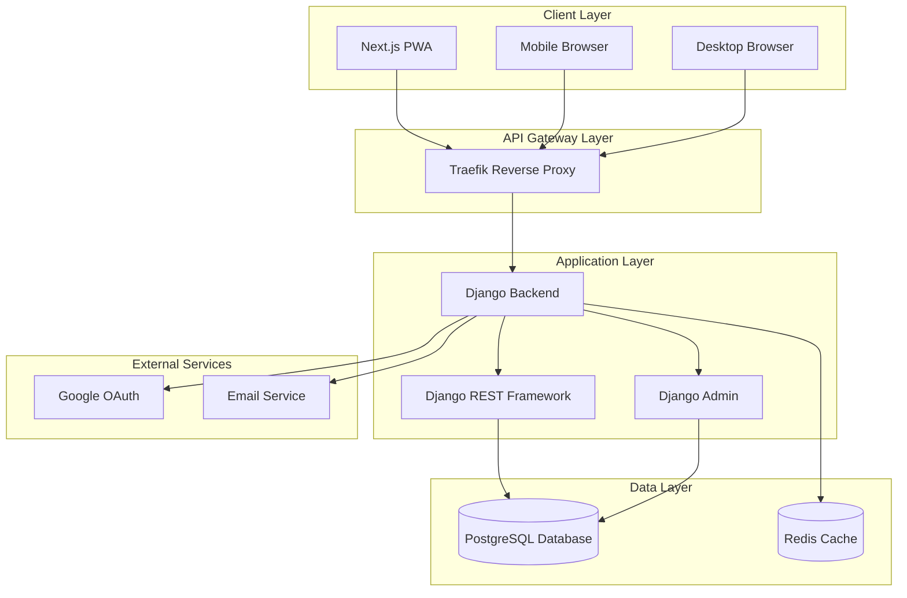

# Design Document

## Overview

The Express Auto Bike Spare and Service Management System is a production-grade full-stack Progressive Web Application (PWA) designed to streamline bike spare parts inventory management, service operations, and customer interactions. The system implements a modern microservices-oriented architecture with a Next.js frontend, Django backend, and PostgreSQL database, all containerized for reliable deployment.

### Key Design Principles

- **Mobile-First Approach**: PWA capabilities ensure optimal mobile experience with offline functionality
- **Security by Design**: Role-based access control with Google OAuth integration and approval workflows
- **Data Integrity**: Backend-as-source-of-truth architecture with comprehensive validation
- **Scalability**: Containerized deployment supporting both VPS and hybrid cloud configurations
- **User Experience**: Barcode scanning integration for efficient inventory and order management

### System Boundaries

The system encompasses:
- **Frontend Application**: Next.js PWA with role-based UI components
- **Backend API**: Django REST Framework with custom admin interface
- **Database Layer**: PostgreSQL with optimized schemas for inventory and transactions
- **Authentication Service**: Google OAuth with custom approval workflow
- **Notification System**: In-app and email notifications for system events
- **Deployment Infrastructure**: Docker containers with Traefik reverse proxy

## Architecture

### System Architecture Overview

The system follows a layered architecture pattern with clear separation of concerns:



### Monorepo Structure

```
express-auto-bike-system/
├── frontend/                 # Next.js PWA application
│   ├── src/
│   │   ├── components/      # Reusable UI components
│   │   ├── pages/          # Next.js pages and API routes
│   │   ├── hooks/          # Custom React hooks
│   │   ├── utils/          # Utility functions
│   │   └── types/          # TypeScript type definitions
│   ├── public/             # Static assets and PWA manifest
│   ├── proxy.ts            # Next.js 16+ proxy (replaces middleware.ts)
│   └── next.config.js      # Next.js configuration with PWA
├── backend/                 # Django application
│   ├── apps/               # Django applications
│   │   ├── authentication/ # User management and OAuth
│   │   ├── inventory/      # Inventory management
│   │   ├── orders/         # Order processing
│   │   ├── returns/        # Returns and credit management
│   │   └── notifications/  # Notification system
│   ├── config/             # Django settings and configuration
│   └── requirements.txt    # Python dependencies
├── shared/                  # Shared components and types
│   ├── types/              # Common TypeScript interfaces
│   ├── constants/          # System constants and enums
│   └── utils/              # Shared utility functions
├── docker/                  # Docker configurations
│   ├── development/        # Development environment
│   ├── production/         # Production environment
│   └── hybrid/             # Hybrid deployment configuration
└── docs/                   # Documentation and deployment guides
```

### Service Communication

- **Frontend-Backend Communication**: RESTful APIs over HTTPS with JWT authentication
- **Database Access**: Django ORM with connection pooling and query optimization
- **External Service Integration**: OAuth 2.0 for Google authentication, SMTP for email notifications
- **Caching Strategy**: Redis for session management and frequently accessed data

## Components and Interfaces

### Frontend Components Architecture

#### Core Components

1. **Layout Components**
   - `Sidebar`: Fixed navigation with role-based menu items
   - `Header`: Application header with user profile access
   - `ProfilePopup`: User information display and logout functionality

2. **Authentication Components**
   - `LoginPage`: Google OAuth integration interface
   - `ApprovalPending`: User approval status display
   - `RoleGuard`: Component-level access control

3. **Inventory Components**
   - `BarcodeScanner`: Camera-based scanning using html5-qrcode
   - `InventoryList`: Paginated inventory display with search
   - `InventoryForm`: Item creation/editing with barcode validation
   - `StockAlert`: Low inventory notification component

4. **Order Management Components**
   - `OrderForm`: Multi-item order creation with barcode scanning
   - `OrderList`: Order history and status tracking
   - `PaymentProcessor`: Payment method selection and processing
   - `ReceiptGenerator`: Order confirmation and receipt display

5. **Returns Components**
   - `ReturnForm`: Return processing with barcode verification
   - `CreditManager`: Customer credit balance display and management
   - `ReturnHistory`: Return transaction tracking

#### PWA Features Implementation

```typescript
// next.config.js PWA configuration
const withPWA = require('next-pwa')({
  dest: 'public',
  register: true,
  skipWaiting: true,
  runtimeCaching: [
    {
      urlPattern: /^https:\/\/api\.example\.com\/.*$/,
      handler: 'NetworkFirst',
      options: {
        cacheName: 'api-cache',
        networkTimeoutSeconds: 10,
      },
    },
  ],
})

module.exports = withPWA({
  // Next.js configuration
})
```

#### Authentication Proxy Implementation

```typescript
// proxy.ts (Next.js 16+ replaces middleware.ts)
import { NextRequest, NextResponse } from 'next/server'

export function proxy(request: NextRequest) {
  // Check authentication for protected routes
  const token = request.cookies.get('auth-token')?.value
  const isAuthPage = request.nextUrl.pathname.startsWith('/login')
  const isProtectedRoute = !request.nextUrl.pathname.startsWith('/public')

  if (!token && !isAuthPage && isProtectedRoute) {
    return NextResponse.redirect(new URL('/login', request.url))
  }

  // Role-based access control
  if (token) {
    const userRole = getUserRoleFromToken(token)
    const isAdminRoute = request.nextUrl.pathname.startsWith('/admin')
    
    if (isAdminRoute && userRole !== 'OWNER') {
      return NextResponse.redirect(new URL('/unauthorized', request.url))
    }
  }

  return NextResponse.next()
}

export const config = {
  matcher: [
    '/((?!api|_next/static|_next/image|favicon.ico|public).*)',
  ],
}
```

### Backend API Architecture

#### Django Applications Structure

1. **Authentication App**
   - Models: `CustomUser`, `UserProfile`, `Role`
   - Views: OAuth callback handling, user approval management
   - Permissions: Role-based access control decorators

2. **Inventory App**
   - Models: `InventoryItem`, `Category`, `StockTransaction`
   - Views: CRUD operations with barcode validation
   - Services: Stock level monitoring and alert generation

3. **Orders App**
   - Models: `Order`, `OrderItem`, `PaymentMethod`
   - Views: Order processing workflow with inventory updates
   - Services: Order status tracking and notification triggers

4. **Returns App**
   - Models: `Return`, `ReturnItem`, `CreditTransaction`
   - Views: Return processing with credit calculation
   - Services: Credit balance management and application

#### API Endpoint Design

```python
# Example API endpoint structure
urlpatterns = [
    path('api/v1/auth/', include('authentication.urls')),
    path('api/v1/inventory/', include('inventory.urls')),
    path('api/v1/orders/', include('orders.urls')),
    path('api/v1/returns/', include('returns.urls')),
    path('api/v1/reports/', include('reports.urls')),
]

# Role-based permission classes
class OwnerOnlyPermission(BasePermission):
    def has_permission(self, request, view):
        return request.user.role == 'OWNER'

class OperationsPermission(BasePermission):
    def has_permission(self, request, view):
        return request.user.role in ['OWNER', 'OPERATIONS']
```

### Database Interface Layer

#### Connection Management
- Django ORM with PostgreSQL adapter
- Connection pooling for performance optimization
- Read/write splitting for scalability (future enhancement)

#### Transaction Management
- Atomic transactions for order processing
- Optimistic locking for inventory updates
- Audit logging for all data modifications

## Data Models

### User Management Schema

```sql
-- Users and Authentication
CREATE TABLE auth_user (
    id SERIAL PRIMARY KEY,
    email VARCHAR(254) UNIQUE NOT NULL,
    google_id VARCHAR(100) UNIQUE,
    is_approved BOOLEAN DEFAULT FALSE,
    role VARCHAR(20) NOT NULL CHECK (role IN ('OWNER', 'OPERATIONS', 'CASHIER', 'DELIVERY', 'CUSTOMER')),
    created_at TIMESTAMP DEFAULT CURRENT_TIMESTAMP,
    updated_at TIMESTAMP DEFAULT CURRENT_TIMESTAMP
);

CREATE TABLE user_profile (
    id SERIAL PRIMARY KEY,
    user_id INTEGER REFERENCES auth_user(id) ON DELETE CASCADE,
    first_name VARCHAR(100),
    last_name VARCHAR(100),
    phone VARCHAR(20),
    avatar_url TEXT,
    notification_preferences JSONB DEFAULT '{}',
    created_at TIMESTAMP DEFAULT CURRENT_TIMESTAMP
);
```

### Inventory Management Schema

```sql
-- Inventory and Products
CREATE TABLE inventory_category (
    id SERIAL PRIMARY KEY,
    name VARCHAR(100) NOT NULL,
    description TEXT,
    parent_id INTEGER REFERENCES inventory_category(id),
    created_at TIMESTAMP DEFAULT CURRENT_TIMESTAMP
);

CREATE TABLE inventory_item (
    id SERIAL PRIMARY KEY,
    barcode VARCHAR(100) UNIQUE NOT NULL,
    name VARCHAR(200) NOT NULL,
    description TEXT,
    category_id INTEGER REFERENCES inventory_category(id),
    unit_price DECIMAL(10,2) NOT NULL,
    stock_quantity INTEGER NOT NULL DEFAULT 0,
    min_stock_level INTEGER DEFAULT 10,
    is_active BOOLEAN DEFAULT TRUE,
    created_by INTEGER REFERENCES auth_user(id),
    created_at TIMESTAMP DEFAULT CURRENT_TIMESTAMP,
    updated_at TIMESTAMP DEFAULT CURRENT_TIMESTAMP
);

CREATE TABLE stock_transaction (
    id SERIAL PRIMARY KEY,
    item_id INTEGER REFERENCES inventory_item(id) ON DELETE CASCADE,
    transaction_type VARCHAR(20) NOT NULL CHECK (transaction_type IN ('IN', 'OUT', 'ADJUSTMENT')),
    quantity INTEGER NOT NULL,
    reference_type VARCHAR(20), -- 'ORDER', 'RETURN', 'ADJUSTMENT'
    reference_id INTEGER,
    notes TEXT,
    created_by INTEGER REFERENCES auth_user(id),
    created_at TIMESTAMP DEFAULT CURRENT_TIMESTAMP
);
```

### Order Management Schema

```sql
-- Orders and Transactions
CREATE TABLE customer_order (
    id SERIAL PRIMARY KEY,
    order_number VARCHAR(50) UNIQUE NOT NULL,
    customer_id INTEGER REFERENCES auth_user(id),
    status VARCHAR(20) NOT NULL DEFAULT 'PENDING' CHECK (status IN ('PENDING', 'CONFIRMED', 'PROCESSING', 'SHIPPED', 'DELIVERED', 'CANCELLED')),
    subtotal DECIMAL(10,2) NOT NULL,
    tax_amount DECIMAL(10,2) DEFAULT 0,
    discount_amount DECIMAL(10,2) DEFAULT 0,
    total_amount DECIMAL(10,2) NOT NULL,
    payment_method VARCHAR(20),
    payment_status VARCHAR(20) DEFAULT 'PENDING',
    notes TEXT,
    created_by INTEGER REFERENCES auth_user(id),
    created_at TIMESTAMP DEFAULT CURRENT_TIMESTAMP,
    updated_at TIMESTAMP DEFAULT CURRENT_TIMESTAMP
);

CREATE TABLE order_item (
    id SERIAL PRIMARY KEY,
    order_id INTEGER REFERENCES customer_order(id) ON DELETE CASCADE,
    item_id INTEGER REFERENCES inventory_item(id),
    quantity INTEGER NOT NULL,
    unit_price DECIMAL(10,2) NOT NULL,
    total_price DECIMAL(10,2) NOT NULL,
    created_at TIMESTAMP DEFAULT CURRENT_TIMESTAMP
);
```

### Returns and Credit Schema

```sql
-- Returns and Credit Management
CREATE TABLE customer_return (
    id SERIAL PRIMARY KEY,
    return_number VARCHAR(50) UNIQUE NOT NULL,
    order_id INTEGER REFERENCES customer_order(id),
    customer_id INTEGER REFERENCES auth_user(id),
    status VARCHAR(20) NOT NULL DEFAULT 'PENDING' CHECK (status IN ('PENDING', 'APPROVED', 'PROCESSED', 'REJECTED')),
    return_reason VARCHAR(100),
    total_amount DECIMAL(10,2) NOT NULL,
    credit_amount DECIMAL(10,2) DEFAULT 0,
    refund_amount DECIMAL(10,2) DEFAULT 0,
    notes TEXT,
    processed_by INTEGER REFERENCES auth_user(id),
    created_at TIMESTAMP DEFAULT CURRENT_TIMESTAMP,
    processed_at TIMESTAMP
);

CREATE TABLE return_item (
    id SERIAL PRIMARY KEY,
    return_id INTEGER REFERENCES customer_return(id) ON DELETE CASCADE,
    order_item_id INTEGER REFERENCES order_item(id),
    quantity INTEGER NOT NULL,
    unit_price DECIMAL(10,2) NOT NULL,
    total_price DECIMAL(10,2) NOT NULL,
    condition VARCHAR(50), -- 'NEW', 'USED', 'DAMAGED'
    created_at TIMESTAMP DEFAULT CURRENT_TIMESTAMP
);

CREATE TABLE customer_credit (
    id SERIAL PRIMARY KEY,
    customer_id INTEGER REFERENCES auth_user(id) ON DELETE CASCADE,
    balance DECIMAL(10,2) NOT NULL DEFAULT 0,
    updated_at TIMESTAMP DEFAULT CURRENT_TIMESTAMP
);

CREATE TABLE credit_transaction (
    id SERIAL PRIMARY KEY,
    customer_id INTEGER REFERENCES auth_user(id),
    transaction_type VARCHAR(20) NOT NULL CHECK (transaction_type IN ('CREDIT', 'DEBIT')),
    amount DECIMAL(10,2) NOT NULL,
    reference_type VARCHAR(20), -- 'RETURN', 'ORDER', 'ADJUSTMENT'
    reference_id INTEGER,
    description TEXT,
    created_by INTEGER REFERENCES auth_user(id),
    created_at TIMESTAMP DEFAULT CURRENT_TIMESTAMP
);
```

### Database Relationships and Constraints

#### Key Relationships
- **User-Order**: One-to-many relationship with customer and created_by references
- **Order-OrderItem**: One-to-many with cascade delete for order items
- **Inventory-StockTransaction**: One-to-many for tracking all stock movements
- **Order-Return**: One-to-many allowing multiple returns per order
- **Customer-Credit**: One-to-one for credit balance management

#### Performance Optimizations
- Indexes on frequently queried fields (barcode, order_number, email)
- Composite indexes for date-range queries on transactions
- Foreign key constraints with appropriate cascade rules
- JSONB fields for flexible notification preferences

#### Data Integrity Rules
- Barcode uniqueness across all inventory items
- Order number generation with sequential numbering
- Stock quantity validation preventing negative values
- Credit balance calculations with transaction audit trail

## Correctness Properties

*A property is a characteristic or behavior that should hold true across all valid executions of a system-essentially, a formal statement about what the system should do. Properties serve as the bridge between human-readable specifications and machine-verifiable correctness guarantees.*

### Property 1: User Registration Default State

*For any* new user registration, the user's approval status should be set to NOT approved by default.

**Validates: Requirements 1.2**

### Property 2: Access Control for Unapproved Users

*For any* unapproved user, all protected system resources should be inaccessible regardless of authentication status.

**Validates: Requirements 1.3**

### Property 3: Owner Exclusive Approval Authority

*For any* user approval status modification, only users with OWNER role should be able to perform the operation.

**Validates: Requirements 1.4**

### Property 4: Valid Role Assignment

*For any* user in the system, their assigned role should be one of the five valid roles: OWNER, OPERATIONS, CASHIER, DELIVERY, or CUSTOMER.

**Validates: Requirements 1.5**

### Property 5: Role-Based API Access Control

*For any* API endpoint and user role combination, access should be granted only if the user's role has the required permissions for that endpoint.

**Validates: Requirements 1.6, 11.4**

### Property 6: Unauthorized Access Error Responses

*For any* unauthorized API request, the system should return appropriate HTTP error status codes (401 or 403) with descriptive error messages.

**Validates: Requirements 1.7, 11.7**

### Property 7: Offline Data Caching

*For any* critical system operation, essential data should be cached and accessible when network connectivity is unavailable.

**Validates: Requirements 2.2, 2.5**

### Property 8: Offline Synchronization

*For any* data modifications made while offline, changes should be synchronized with the backend when network connectivity is restored.

**Validates: Requirements 2.6**

### Property 9: Barcode Format Validation

*For any* barcode input, the system should validate the format and reject invalid barcodes with appropriate error messages.

**Validates: Requirements 3.4, 3.5**

### Property 10: Barcode Format Support

*For any* standard retail barcode format, the system should be able to successfully decode and process the barcode.

**Validates: Requirements 3.6**

### Property 11: Mandatory Barcode Scanning

*For any* inventory item creation, order processing, or return processing operation, the system should require valid barcode scanning before allowing the operation to complete.

**Validates: Requirements 3.2, 3.3, 4.2, 5.2, 6.1**

### Property 12: Inventory Data Completeness

*For any* inventory item, the system should maintain complete records including stock levels, pricing, and item descriptions.

**Validates: Requirements 4.1, 4.3**

### Property 13: Low Stock Alert Generation

*For any* inventory item with stock levels at or below the minimum threshold, the system should generate appropriate low stock alerts.

**Validates: Requirements 4.4**

### Property 14: Inventory Transaction Audit Trail

*For any* inventory stock level change, the system should create corresponding transaction records with proper audit information.

**Validates: Requirements 4.6**

### Property 15: Real-Time Inventory Consistency

*For any* operation that affects inventory levels (orders, returns, adjustments), the inventory records should be updated immediately and consistently.

**Validates: Requirements 4.7, 5.4, 6.2**

### Property 16: Multi-Item Order Support

*For any* order creation, the system should support adding multiple different inventory items to a single order.

**Validates: Requirements 5.1**

### Property 17: Order Total Calculation Accuracy

*For any* order with items, taxes, and discounts, the calculated total should accurately reflect the sum of item prices plus taxes minus discounts.

**Validates: Requirements 5.3**

### Property 18: Order Documentation Generation

*For any* completed order, the system should generate proper receipts and tracking information.

**Validates: Requirements 5.5**

### Property 19: Payment Method Support

*For any* order processing, the system should support multiple payment methods and maintain accurate payment status tracking.

**Validates: Requirements 5.6**

### Property 20: Return Processing with Inventory Updates

*For any* processed return, the system should increase inventory stock levels for returned items and maintain proper return documentation.

**Validates: Requirements 6.2, 6.5, 6.6**

### Property 21: Credit System Balance Consistency

*For any* customer credit transaction (returns, refunds, purchases), the customer's credit balance should be accurately maintained and automatically applied to future purchases.

**Validates: Requirements 6.3, 6.4, 6.7**

### Property 22: Django Admin Access Restriction

*For any* attempt to access Django admin interface, only users with OWNER role should be granted access, while all other users should be denied.

**Validates: Requirements 7.1, 7.3**

### Property 23: Admin Activity Audit Logging

*For any* Django admin operation, the system should log the activity with user identification and timestamp information.

**Validates: Requirements 7.5**

### Property 24: Role-Based UI Adaptation

*For any* user interface element (menus, links, buttons), visibility and accessibility should be determined by the user's role permissions.

**Validates: Requirements 7.2, 8.1, 8.5**

### Property 25: User Profile Data Completeness

*For any* user profile display, the system should show complete user information including avatar, name, role, email, phone, and Google ID.

**Validates: Requirements 8.2, 8.3**

### Property 26: Session Termination on Logout

*For any* logout operation, the system should properly terminate the user session and clear authentication tokens.

**Validates: Requirements 8.4**

### Property 27: Report Generation with Filtering

*For any* report type (sales, inventory, customer, returns), the system should generate accurate reports with proper date range filtering and data completeness.

**Validates: Requirements 9.1, 9.2, 9.3, 9.4**

### Property 28: Multi-Format Report Export

*For any* generated report, the system should support export in multiple formats (PDF, Excel, CSV) with consistent data representation.

**Validates: Requirements 9.5**

### Property 29: Dashboard KPI Accuracy

*For any* dashboard analytics display, the key performance indicators should accurately reflect current system data and calculations.

**Validates: Requirements 9.6**

### Property 30: RESTful API Compliance

*For any* API endpoint, the implementation should follow REST conventions with appropriate HTTP methods and response formats.

**Validates: Requirements 11.1, 11.5**

### Property 31: API Input Validation

*For any* API request with invalid input data, the system should return appropriate validation error responses with descriptive messages.

**Validates: Requirements 11.2**

### Property 32: Backend Data Authority

*For any* data operation, the backend should serve as the authoritative source of truth with proper validation and consistency checks.

**Validates: Requirements 11.3**

### Property 33: Concurrent Operation Safety

*For any* concurrent data operations, the system should maintain data integrity without corruption or inconsistent states.

**Validates: Requirements 11.6**

### Property 34: Comprehensive Notification Triggering

*For any* system event that requires notification (low inventory, order status changes, pending approvals), appropriate notifications should be generated and delivered.

**Validates: Requirements 12.1, 12.2, 12.3, 5.7**

### Property 35: Notification Display and Delivery

*For any* generated notification, the system should display it in the application interface and support email delivery for critical events.

**Validates: Requirements 12.4, 12.5**

### Property 36: Notification Preference Management

*For any* user notification preferences, the system should allow configuration and respect the user's chosen settings.

**Validates: Requirements 12.6**

### Property 37: Notification Delivery Reliability

*For any* notification delivery attempt, the system should track delivery status and retry failed deliveries appropriately.

**Validates: Requirements 12.7**
## Error Handling

### Error Classification and Response Strategy

The system implements a comprehensive error handling strategy with consistent error responses across all layers:

#### Authentication and Authorization Errors

```typescript
// Frontend error handling for authentication
interface AuthError {
  code: 'AUTH_REQUIRED' | 'INVALID_TOKEN' | 'INSUFFICIENT_PERMISSIONS' | 'ACCOUNT_NOT_APPROVED';
  message: string;
  details?: Record<string, any>;
}

// Backend error responses
HTTP 401 Unauthorized: {
  "error": "AUTH_REQUIRED",
  "message": "Authentication required to access this resource",
  "timestamp": "2024-01-15T10:30:00Z"
}

HTTP 403 Forbidden: {
  "error": "INSUFFICIENT_PERMISSIONS", 
  "message": "User role 'CASHIER' does not have permission for this operation",
  "required_role": "OPERATIONS"
}
```

#### Validation and Input Errors

```python
# Django REST Framework validation
class InventoryItemSerializer(serializers.ModelSerializer):
    def validate_barcode(self, value):
        if not self.is_valid_barcode_format(value):
            raise serializers.ValidationError(
                "Invalid barcode format. Supported formats: UPC, EAN, Code128"
            )
        return value

# API error response format
HTTP 400 Bad Request: {
  "error": "VALIDATION_ERROR",
  "message": "Invalid input data provided",
  "field_errors": {
    "barcode": ["Invalid barcode format. Supported formats: UPC, EAN, Code128"],
    "stock_quantity": ["Stock quantity cannot be negative"]
  }
}
```

#### Business Logic Errors

```typescript
// Inventory management errors
interface InventoryError {
  code: 'INSUFFICIENT_STOCK' | 'ITEM_NOT_FOUND' | 'BARCODE_DUPLICATE';
  message: string;
  available_stock?: number;
  requested_quantity?: number;
}

// Order processing errors
HTTP 409 Conflict: {
  "error": "INSUFFICIENT_STOCK",
  "message": "Not enough stock available for item 'Brake Pad Set'",
  "available_stock": 5,
  "requested_quantity": 10,
  "item_barcode": "1234567890123"
}
```

#### System and Infrastructure Errors

```typescript
// Database connection errors
interface SystemError {
  code: 'DATABASE_ERROR' | 'EXTERNAL_SERVICE_ERROR' | 'CACHE_ERROR';
  message: string;
  retry_after?: number;
}

// Service unavailable responses
HTTP 503 Service Unavailable: {
  "error": "DATABASE_ERROR",
  "message": "Database connection temporarily unavailable",
  "retry_after": 30
}
```

### Error Recovery Mechanisms

#### Frontend Error Recovery

1. **Automatic Retry Logic**: Network errors trigger exponential backoff retry
2. **Offline Fallback**: Critical operations queue for later synchronization
3. **User Feedback**: Clear error messages with suggested actions
4. **Graceful Degradation**: Non-critical features fail silently with logging

#### Backend Error Recovery

1. **Database Transaction Rollback**: Atomic operations with automatic rollback on failure
2. **Circuit Breaker Pattern**: External service failures trigger circuit breaker
3. **Dead Letter Queue**: Failed notification deliveries queue for retry
4. **Health Check Endpoints**: System health monitoring and alerting

### Logging and Monitoring

```python
# Structured logging configuration
LOGGING = {
    'version': 1,
    'handlers': {
        'file': {
            'class': 'logging.handlers.RotatingFileHandler',
            'filename': 'logs/application.log',
            'formatter': 'json',
        },
    },
    'loggers': {
        'inventory': {'level': 'INFO'},
        'orders': {'level': 'INFO'},
        'authentication': {'level': 'WARNING'},
    }
}

# Error tracking integration
import sentry_sdk
sentry_sdk.init(
    dsn="your-sentry-dsn",
    traces_sample_rate=0.1,
    environment="production"
)
```

## Testing Strategy

### Dual Testing Approach

The system employs both unit testing and property-based testing for comprehensive coverage:

- **Unit Tests**: Verify specific examples, edge cases, and integration points
- **Property Tests**: Verify universal properties across all possible inputs
- **Integration Tests**: Verify component interactions and API contracts
- **End-to-End Tests**: Verify complete user workflows

### Property-Based Testing Implementation

#### Testing Library Selection

**Frontend (TypeScript/JavaScript)**: fast-check library
```typescript
import fc from 'fast-check';

// Example property test for order total calculation
describe('Order Total Calculation', () => {
  it('Property 17: Order total accuracy', () => {
    fc.assert(fc.property(
      fc.array(fc.record({
        price: fc.float({ min: 0.01, max: 1000 }),
        quantity: fc.integer({ min: 1, max: 100 })
      })),
      fc.float({ min: 0, max: 0.2 }), // tax rate
      fc.float({ min: 0, max: 100 }), // discount
      (items, taxRate, discount) => {
        const subtotal = items.reduce((sum, item) => sum + (item.price * item.quantity), 0);
        const tax = subtotal * taxRate;
        const total = subtotal + tax - discount;
        
        const calculatedTotal = calculateOrderTotal(items, taxRate, discount);
        
        expect(Math.abs(calculatedTotal - total)).toBeLessThan(0.01);
      }
    ), { numRuns: 100 });
  });
});
```

**Backend (Python)**: Hypothesis library
```python
from hypothesis import given, strategies as st
import pytest

class TestInventoryProperties:
    @given(st.text(min_size=1, max_size=100))
    def test_property_11_barcode_requirement(self, barcode):
        """
        Feature: express-auto-bike-management-system, Property 11: 
        Mandatory barcode scanning for inventory operations
        """
        # Test that inventory creation requires valid barcode
        with pytest.raises(ValidationError):
            InventoryItem.objects.create(
                name="Test Item",
                # Missing barcode should raise validation error
            )
    
    @given(st.integers(min_value=1, max_value=1000))
    def test_property_15_inventory_consistency(self, quantity):
        """
        Feature: express-auto-bike-management-system, Property 15:
        Real-time inventory consistency
        """
        item = InventoryItemFactory(stock_quantity=quantity)
        initial_stock = item.stock_quantity
        
        # Create order that reduces stock
        order = OrderFactory()
        OrderItem.objects.create(
            order=order,
            item=item,
            quantity=5
        )
        
        # Complete order to trigger inventory update
        order.complete()
        
        item.refresh_from_db()
        assert item.stock_quantity == initial_stock - 5
```

#### Property Test Configuration

All property tests must:
- Run minimum 100 iterations per test
- Include descriptive test tags referencing design properties
- Use appropriate data generators for realistic test scenarios
- Validate both success and failure conditions

### Unit Testing Strategy

#### Frontend Unit Tests (Jest + React Testing Library)

```typescript
// Component testing example
describe('BarcodeScanner Component', () => {
  it('should display error for invalid barcode format', async () => {
    render(<BarcodeScanner onScan={mockOnScan} />);
    
    const invalidBarcode = 'invalid-format';
    fireEvent.change(screen.getByRole('textbox'), {
      target: { value: invalidBarcode }
    });
    
    expect(screen.getByText(/invalid barcode format/i)).toBeInTheDocument();
  });
  
  it('should call onScan with valid barcode', async () => {
    const mockOnScan = jest.fn();
    render(<BarcodeScanner onScan={mockOnScan} />);
    
    const validBarcode = '1234567890123';
    fireEvent.change(screen.getByRole('textbox'), {
      target: { value: validBarcode }
    });
    
    expect(mockOnScan).toHaveBeenCalledWith(validBarcode);
  });
});
```

#### Backend Unit Tests (pytest + Django)

```python
class TestOrderProcessing:
    def test_order_creation_with_multiple_items(self):
        """Test that orders can contain multiple inventory items"""
        order = Order.objects.create(customer=self.customer)
        
        item1 = InventoryItemFactory()
        item2 = InventoryItemFactory()
        
        OrderItem.objects.create(order=order, item=item1, quantity=2)
        OrderItem.objects.create(order=order, item=item2, quantity=1)
        
        assert order.items.count() == 2
        assert order.total_items == 3
    
    def test_insufficient_stock_error(self):
        """Test error handling for insufficient stock"""
        item = InventoryItemFactory(stock_quantity=5)
        order = Order.objects.create(customer=self.customer)
        
        with pytest.raises(InsufficientStockError) as exc_info:
            OrderItem.objects.create(
                order=order,
                item=item,
                quantity=10  # More than available stock
            )
        
        assert "Not enough stock available" in str(exc_info.value)
```

### Integration Testing

#### API Integration Tests

```python
class TestAPIIntegration:
    def test_order_processing_workflow(self):
        """Test complete order processing workflow"""
        # Authenticate user
        self.client.force_authenticate(user=self.cashier_user)
        
        # Create order
        order_data = {
            'customer': self.customer.id,
            'items': [
                {'barcode': '1234567890123', 'quantity': 2},
                {'barcode': '9876543210987', 'quantity': 1}
            ]
        }
        
        response = self.client.post('/api/v1/orders/', order_data)
        assert response.status_code == 201
        
        # Verify inventory updates
        item1 = InventoryItem.objects.get(barcode='1234567890123')
        assert item1.stock_quantity == self.initial_stock - 2
```

### End-to-End Testing

#### Playwright E2E Tests

```typescript
// E2E test for complete user workflow
test('complete order processing workflow', async ({ page }) => {
  // Login as cashier
  await page.goto('/login');
  await page.click('[data-testid="google-login"]');
  
  // Navigate to orders
  await page.click('[data-testid="orders-menu"]');
  
  // Create new order
  await page.click('[data-testid="new-order-button"]');
  
  // Scan barcode for item
  await page.fill('[data-testid="barcode-input"]', '1234567890123');
  await page.click('[data-testid="add-item-button"]');
  
  // Complete order
  await page.click('[data-testid="complete-order-button"]');
  
  // Verify success message
  await expect(page.locator('[data-testid="success-message"]')).toBeVisible();
});
```

### Test Coverage Requirements

- **Unit Test Coverage**: Minimum 80% code coverage for all modules
- **Property Test Coverage**: All correctness properties must have corresponding property tests
- **Integration Test Coverage**: All API endpoints must have integration tests
- **E2E Test Coverage**: All critical user workflows must have E2E tests

### Continuous Integration

```yaml
# GitHub Actions workflow
name: Test Suite
on: [push, pull_request]

jobs:
  frontend-tests:
    runs-on: ubuntu-latest
    steps:
      - uses: actions/checkout@v3
      - uses: actions/setup-node@v3
      - run: npm ci
      - run: npm run test:unit
      - run: npm run test:property
      - run: npm run test:e2e
  
  backend-tests:
    runs-on: ubuntu-latest
    steps:
      - uses: actions/checkout@v3
      - uses: actions/setup-python@v4
      - run: pip install -r requirements.txt
      - run: pytest --cov=apps --cov-report=xml
      - run: pytest --hypothesis-profile=ci
```

The testing strategy ensures comprehensive validation of system correctness through multiple complementary approaches, with property-based testing providing mathematical rigor and unit tests covering specific scenarios and edge cases.